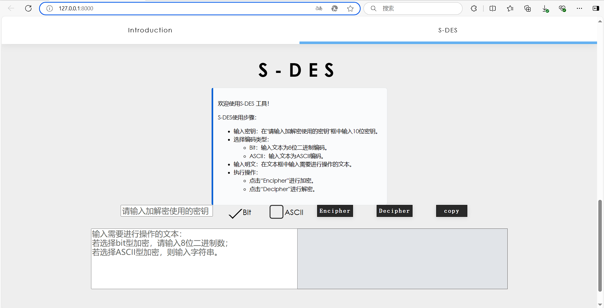
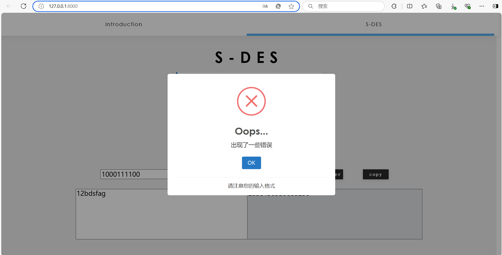

# cqu_s-des
信息安全导论项目1：S-DES算法实现

### 1. 算法实现

> S-DES算法实现在`SDES/SDES.py`文件中，使用到S-DES算法的加密和解密两个函数。 

为了实现良好的代码封装，本项目定义了一个SDES的加密类。

- 初始化函数为：`def __init__(self, key, P10, P8, IP, IP_INV, EP, S0, S1, P4):`
  - 其中`key`为10位二进制字符串，`P10`、`P8`、`IP`、`IP_INV`、`EP`、`S0`、`S1`、`P4`为置换表，如果不传入，则使用默认的置换表。
  - 我们设计中将作业要求中的置换表作为默认置换表，因此在实验使用时，可以不传入置换表。
- 定义了：`def permute(self, block, table):`函数，用于实现置换操作。
- 定义了：`def left_shift(self, block, shifts):`函数，用于实现循环左移操作，可以选择移动位数。
- 定义了：`def key_generation(self):`函数，用于生成子密钥。
- 定义了：`def f(self, right, subkey):`函数，轮函数f，负责进行扩展、置换、S盒转换等操作。
- 以及加密函数：`def encrypt(self, plaintext):`和解密函数：`def decrypt(self, ciphertext):`。 

对SDES类调用`encrypt`和`decrypt`函数就可以进行加密和解密操作。

### 2. GUI设计
> - 本项目设计了一个交互良好的界面，使用了`Django`框架进行GUI设计，设计了相应的Web网页来实现所需效果。
> - 我们的GUI设计中，主要分为三个页面，分别是`首页（index)`、`介绍（Introduction）`、`S-DES`。

#### 2.1 Index界面

index界面是程序的首页，包含标题和小组成员信息：


#### 2.2 Introduction界面

Introduction界面是第二页，也是导航栏中的第一个元素，简要介绍了项目所需实现的算法：


#### 2.3 S-DES界面

S-DES界面是本项目的核心界面，为用户提供了可交互的前端GUI。在界面的前半部分提供使用说明，而界面的后半部分供用户进行输入，点击Encipher或者Decipher即完成加解密操作，并可以使用copy一键复制转换结果。



### 3. 项目运行和Django框架

#### 3.1 安装Django

```shell
pip install django
```

#### 3.2 运行项目

```shell
python manage.py runserver
```

### 4. 编程和测试要求

#### 4.1 第1关：基本测试

> 根据S-DES算法编写和调试程序，提供GUI解密支持用户交互。输入可以是8bit的数据和10bit的密钥，输出是8bit的密文。
> - 具体测试代码请看[test测试文件夹](https://github.com/Zhengupp/cqu_s-des/tree/6473241ec550878a28bed1f759f1b2dbbd9ebd03/test)。

##### 4.1.1 GUI界面中测试

输入可以是8bit的数据和10bit的密钥，输出是8bit的密文：


当输出不符合标准时，返回处理失败的错误：



##### 4.1.2 测试代码中测试

我们在`/test`文件夹中提供了jupyter notebook的测试代码，可以直接打开test测试文件夹中的[task1.ipynb](https://github.com/Zhengupp/cqu_s-des/blob/6473241ec550878a28bed1f759f1b2dbbd9ebd03/test/task1.ipynb)，即可看到测试结果。

#### 4.2 第2关：交叉测试

> 考虑到是**算法标准**，所有人在编写程序的时候需要使用相同算法流程和转换单元(P-Box、S-Box等)，以保证算法和程序在异构的系统或平台上都可以正常运行。设有A和B两组位同学(选择相同的密钥K)；则A、B组同学编写的程序对明文P进行加密得到相同的密文C；或者B组同学接收到A组程序加密的密文C，使用B组程序进行解密可得到与A相同的P。
> - 具体详细测试代码请看[test测试文件夹](https://github.com/Zhengupp/cqu_s-des/tree/6473241ec550878a28bed1f759f1b2dbbd9ebd03/test)。

本项目与另一个小组进行了交叉测试，验证了我们加密算法的正确性。

我们在`/test`文件夹中提供了与两个小组测试的jupyter notebook测试代码，可以直接打开test测试文件夹中的[task2.ipynb](https://github.com/Zhengupp/cqu_s-des/blob/6473241ec550878a28bed1f759f1b2dbbd9ebd03/test/task2.ipynb)，即可看到测试结果。

#### 4.3 第3关：扩展功能

> 考虑到向实用性扩展，加密算法的数据输入可以是ASII编码字符串(分组为1 Byte)，对应地输出也可以是ACII字符串(很可能是乱码)。
> - 具体详细测试代码请看[test测试文件夹](https://github.com/Zhengupp/cqu_s-des/tree/6473241ec550878a28bed1f759f1b2dbbd9ebd03/test)。

##### 4.3.1 测试代码中测试

我们在`/test`文件夹中提供了jupyter notebook的测试代码，可以直接打开test测试文件夹中的[task3.ipynb](https://github.com/Zhengupp/cqu_s-des/blob/6473241ec550878a28bed1f759f1b2dbbd9ebd03/test/task3.ipynb)，即可看到测试结果。

##### 4.3.2 ASCII码加密时的处理

因为我们常用的字符集仅仅只是0-127位的ASCII码，所以我们在加密时对应的只剩下了7位bit，这并不符合SDES算法的加密要求，我们综合考虑多种方式之后选择了更为全面的Unicode字符集，选取前256作为我们的字符集。

同时ASCII字符在加密后往往会出现乱码或者无法显示的控制符（但是不影响解密，只要正确复制后即可正常解密）。
所以我们在加密ASCII码是采用了显示十六进制的加密结果，而不是对应的Unicode字符，避免了很多无法显示的结果与乱码。
在对应的解密阶段我们也采用了十六进制的解密方式，将十六进制的密文转换为对应的ASCII码，这样就可以避免乱码的出现。

#### 4.4 第4关：暴力破解

> 假设你找到了使用相同密钥的明、密文对(一个或多个)，请尝试使用暴力破解的方法找到正确的密钥Key。在编写程序时，你也可以考虑使用多线程的方式提升破解的效率。请设定时间戳，用视频或动图展示你在多长时间内完成了暴力破解。
> - 具体详细测试代码请看[test测试文件夹](https://github.com/Zhengupp/cqu_s-des/tree/6473241ec550878a28bed1f759f1b2dbbd9ebd03/test)。

为了测试SDES算法的安全性，我们在该轮测试中进行了暴力破解的测试，验证了我们加密算法的安全性。

我们给出了三组明文密文对，并依次对密钥进行了暴力破解.

我们在`/test`文件夹中提供了三组明密文对的jupyter notebook测试代码，可以直接打开test测试文件夹中的[task4.ipynb](https://github.com/Zhengupp/cqu_s-des/blob/6473241ec550878a28bed1f759f1b2dbbd9ebd03/test/task4.ipynb)，即可看到测试结果。

就结果来看，我们可以通过jupyter中代码框的运行时间来看到，我们的暴力破解算法的运行时间基本在毫秒级，大多在20+ms就可以完成破解，并给出全部的可能的key。

同时我们也发现了每一对明密文对都可能会对应多个可解的key，这在后续第5关会进行详细讨论。

#### 4.5 第5关：封闭测试

>  根据第4关的结果，进一步分析，对于你随机选择的一个明密文对，是不是有不止一个密钥Key？进一步扩展，对应明文空间任意给定的明文分组P_{n}，是否会出现选择不同的密钥K_{i}\ne K_{j}加密得到相同密文C_n的情况？
> - 具体详细测试代码请看[test测试文件夹](https://github.com/Zhengupp/cqu_s-des/tree/6473241ec550878a28bed1f759f1b2dbbd9ebd03/test)。

我们在该轮测试中进行了封闭测试，讨论了SDES算法的安全性，推测原因可归结为以下几点：

- 固有的冗余：当使用某些加密方法（如S-盒、置换等）时，如果这些方法内部包含冗余或对称性，那么不同的输入可能会导致相同的输出。 
- 简化的结构：S-DES与真正的DES相比具有简化的结构，这意味着其加密过程没有充分混淆明文和密钥，从而更容易出现不同的明文和密钥组合导致相同的密文输出。 
- 小密钥空间：S-DES只有10位密钥，意味着只有2^10 = 1024 种可能的密钥。这样的小密钥空间使得碰撞更为可能。

相关讨论我们放在了`/test`文件夹中的[task5.ipynb](https://github.com/Zhengupp/cqu_s-des/blob/6473241ec550878a28bed1f759f1b2dbbd9ebd03/test/task5.ipynb)，即可以看到详细的讨论过程。

同时，我们针对对应明文空间任意给定的明文分组P_{n}，是否会出现选择不同的密钥K_{i}\ne K_{j}加密得到相同密文C_n的情况也进行了检测，得到了肯定的结果，在jupyter文件中也进行了一定的讨论。

每个明文在用全部1024个可能的密钥加密后只会产生254个密文，并且统计结果相似：


推测原因如下：

- 重叠扩展置换。在S-DES中，有一个扩展置换（EP）,它会将4位的输入扩展到8位。这个扩展不是简单地增加更多的信息，而是重复某些位。这意味着当这些位参与到与密钥的XOR操作中时，某些密钥位会影响到重叠的位。因此，不同的密钥可能会导致加密过程中的这些重叠位的相同结果。 
- 密钥调度。在S-DES中，生成两个子密钥的过程涉及到置换和循环左移。这可能导致不同的10位密钥产生相同的8位子密钥。

相关的讨论我们放在了`/test`文件夹中的[task5.ipynb](https://github.com/Zhengupp/cqu_s-des/blob/6473241ec550878a28bed1f759f1b2dbbd9ebd03/test/task5.ipynb)，即可以看到详细的讨论过程。

---
**本项目完成了S-DES加密算法的基本实现、GUI界面的设计，以及任务中提到的五个要求，完成了本次实验要求。**
